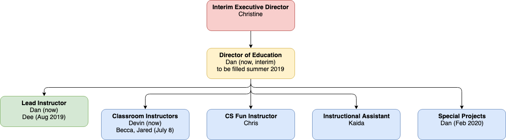

# Instructional Team Update

_by Dan Roberts, Lead Instructor / Interim Director of Education_

Hello Ada community! 

I've spent some time reading through your responses to the strategic planning survey we sent out last week. Something that stood out to me from the written comments is that we haven't done a particularly good job of communicating what the instructional team looks like these days. So with [the "T" in SECRETS](https://adadevacademy.tumblr.com/post/184580936337/wed-love-to-let-you-in-on-the-ada-secrets) in mind, I figured I would write a little update on who's here and what we're working on.

## Staff Movement

First the bad news. Charles and Shruti both left the instructional team this spring to pursue other opportunities. We're still on good terms with both of them, and you may even see Charles volunteering at Ada this summer to support capstones. But, neither is currently on payroll.

In the past Ada has scrambled to cover when an instructor leaves, but this time I would say we did alright. We brought Kaida Masaki on as a new instructional assistant in February, and she's done a fantastic job spinning up on our curriculum and tooling, and working on admissions for C12.

Heroic as always, in addition to his normal classroom responsibilities Chris covered the tail end of CS Fundamentals for C11. He will be transitioning to teaching CS Fundamentals full-time starting in C12 - be sure to congratulate him if you see him. We're quite excited about the ideas he has about where to take the curriculum, particularly around making sure everyone is prepared for interviews.

One of the things we've been working on during this time is building out a hiring process for instructors that is efficient and repeatable. It's not as robust as I'd like it to be - we've struggled to find candidates of color, and the lead time for a hire is still too long. Even so, I would say Ada is much better equipped to hire an instructor now than it was in, say, December of 2017.

As evidence of that improvement, we have not one but two new instructors starting on July 8th. Becca Elenzil is a high school computer science teacher with a Ph.D. in Bioengineering, and Jared Maddox is an full-stack software engineer with experience working with Ada students and alums. We're excited about each of them individually, but especially about the way their skillsets compliment each other. Both will be classroom instructors for C12, Jared teaching the Branches classroom with Dee, and Becca teaching Leaves with Devin. You'll see proper introductions from each of them in the next week or so.

## Leadership

"Wait a second Dan" you might say, "your name isn't on that list of teachers!" Good observation. I will be taking a leave of absence for C12 to relax and travel, with the full intention of coming back in February 2020 for C13. Let's talk about what that means for the team's leadership.

First, the Director of Education role. The DoE is the manager of the instructional team, and handles staffing, career growth, and coordination with the other parts of the org. I've been bungling through this in addition to my regular Lead Instructor job informally since June of last year when Kari went on maternity leave, and formally since late October when she left for good.

This hiring process for DoE stalled out over the winter amidst the other changes that were going on, but since Christine Martin came on as our Interim Executive Director this spring we've made solid progress. TSNE HR will have my head if I give too many details, but I am confident that we will have the right person hired as Ada's Director of Education before the end of the summer.

Second, the Lead Instructor position. You can think of the lead instructor as equivalent to a technical lead on an engineering team - they're still teaching in the classroom, but they also establish best practices, coordinate instructor work, and serve as the final owner of the classroom experience. I am delighted to inform you that Dee will be taking on this role in August for the start of C12. Dee has been teaching with Ada for almost 2 years now, and they have done an excellent job of picking up the slack I've left while focusing on DoE work. They were a natural choice for the job.

## Special Projects

So what will I be doing when I get back in February? A number of things, which I've taken to thinking of as "special projects" for the instructional team. I'll spend some time supporting the existing program, working on curriculum or subbing in if a teacher gets sick or takes time off. I might get tapped to do big chunks of curriculum work if we determine they're needed. But the project I'm most excited about is rolling out a continuing education program for Ada alums.

The idea of a post-Ada curriculum is something we've had our eye on for a while now, and it was one of the ideas that got the most enthusiastic response in the strategic planning survey (right up there with a pre-Ada program, which we're also currently investigating). We see this as a relatively low-cost, low-risk way to better support our community and further our mission, helping our alums to move up the career ladder and into senior and leadership roles.

There were definitely some concerns along with the enthusiasm in the survey and we want to make sure we get this one right, with an eye toward equity and supporting the members of our community who need it most. We'll be sending out another survey to alums in the next week or so seeking input about this project. If you have thoughts on what we should offer, how much it should cost or how the courses should be structured that will be your opportunity to share them. If you have more nuanced ideas that don't necessarily fit in a survey response, send me an email (dan at adadev dot org) and let's go get coffee.